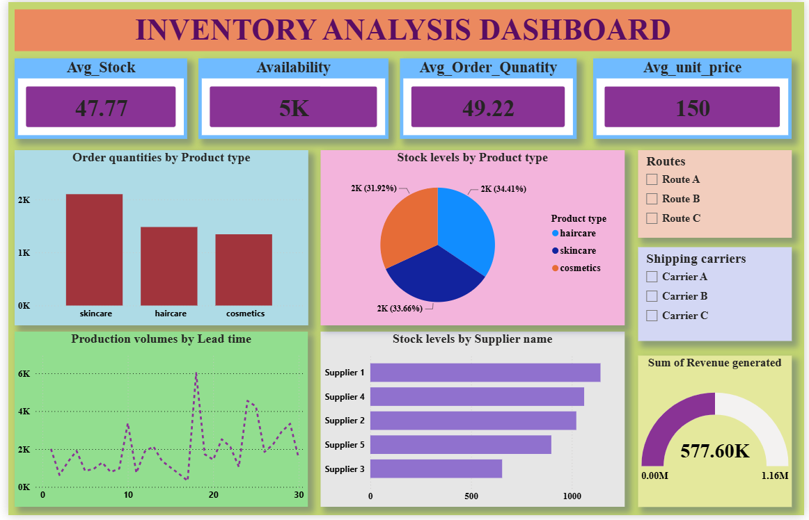

# 📦 Supply Chain Analysis

A comprehensive **Supply Chain Analysis** project that analyzes business operations using interactive dashboards and business intelligence techniques. The project provides insights into sales performance, inventory management, supplier efficiency, manufacturing, and logistics to support data-driven decision-making.

---

## 📖 Project Overview

The objective of this project is to analyze supply chain data and identify trends that improve operational efficiency and business performance.

The analysis focuses on:

- 📈 Sales Performance
- 💰 Profitability Analysis
- 📦 Inventory Management
- 🚚 Logistics & Transportation
- 🏭 Manufacturing Performance
- 🤝 Supplier Performance
- 🌍 Regional Sales Analysis
- 📊 Executive Business Overview

The repository includes a detailed analysis report, PowerPoint presentation, and dashboard screenshots.

---

## 🎯 Objectives

- Analyze key supply chain performance metrics.
- Monitor inventory levels and stock movement.
- Evaluate supplier performance.
- Analyze manufacturing efficiency.
- Measure logistics and transportation performance.
- Build interactive dashboards for business decision-making.
- Generate actionable business insights.

---

# 📂 Repository Structure

```text
Supply-Chain-Analysis/
│
├── Analysis Report for Supply Chain Analysis Project.pdf
├── Executive_supplychain_dashboard.png
├── Inventory_Analysis Dashboard.png
├── Logistics and transportation dashboard.png
├── Manufacturing_Analysis dashboard.png
├── Supplier_performance Dashboard.png
├── Supply Chain Performance Analysis.pptx
├── README.md
```

---

# 📊 Dashboards Included

## 📈 Executive Dashboard

Provides an overall business summary including:

- Total Sales
- Total Profit
- Total Orders
- Revenue Trends
- Sales by Region
- KPI Summary

---

## 📦 Inventory Analysis Dashboard

Focuses on inventory operations including:

- Inventory Levels
- Stock Availability
- Inventory Turnover
- Product Demand
- Stock Status

---

## 🚚 Logistics & Transportation Dashboard

Provides logistics insights such as:

- Shipping Performance
- Delivery Time
- Transportation Cost
- Shipment Status
- Logistics KPIs

---

## 🏭 Manufacturing Dashboard

Analyzes manufacturing operations:

- Production Performance
- Manufacturing Cost
- Production Efficiency
- Capacity Utilization
- Manufacturing KPIs

---

## 🤝 Supplier Performance Dashboard

Evaluates supplier effectiveness using:

- Supplier Performance Score
- Supplier Reliability
- Delivery Performance
- Purchase Analysis
- Supplier Ranking

---

# 📑 Analysis Report

The report contains:

- Business Problem
- Dataset Overview
- Data Cleaning
- KPI Analysis
- Dashboard Interpretation
- Business Insights
- Recommendations

---

# 📽 Presentation

The PowerPoint presentation summarizes:

- Project Overview
- Business Objectives
- Dataset
- Dashboard Walkthrough
- Key Findings
- Business Recommendations

---

# 📊 Key Performance Indicators (KPIs)

- Total Sales
- Total Revenue
- Total Profit
- Total Orders
- Inventory Turnover
- Average Delivery Time
- Shipping Cost
- Manufacturing Efficiency
- Supplier Performance
- Regional Sales

---

# 📌 Key Insights

- High-performing products contribute significantly to overall revenue.
- Inventory optimization helps reduce operational costs.
- Manufacturing efficiency directly impacts profitability.
- Delivery delays affect customer satisfaction.
- Supplier performance differs across vendors.
- Regional sales trends highlight profitable markets.
- Logistics optimization reduces transportation costs.

---

# 🚀 Business Recommendations

- Improve inventory planning to avoid stock shortages.
- Optimize logistics routes to reduce delivery delays.
- Strengthen partnerships with reliable suppliers.
- Improve manufacturing efficiency to reduce production costs.
- Focus marketing efforts on high-performing regions.
- Continuously monitor KPIs using interactive dashboards.

---

# 🛠 Tools & Technologies

- Microsoft Excel
- Power BI
- Microsoft PowerPoint
- Data Visualization
- Business Analytics
- Supply Chain Analytics

---

# 📷 Dashboard Preview

### Executive Dashboard


---

### Inventory Dashboard



---

### Logistics & Transportation Dashboard


---

### Manufacturing Dashboard


---

### Supplier Performance Dashboard


---

# 📚 Files Included

| File | Description |
|------|-------------|
| Analysis Report | Complete project documentation |
| PowerPoint Presentation | Project summary |
| Dashboard Images | Dashboard screenshots |
| README.md | Project documentation |

---

# 🎓 Learning Outcomes

This project demonstrates skills in:

- Supply Chain Analytics
- Business Intelligence
- Dashboard Development
- Data Visualization
- KPI Analysis
- Business Reporting
- Decision Support Analytics

---

# 🤝 Contributing

Contributions are welcome.

1. Fork the repository

2. Create a feature branch

```bash
git checkout -b feature-name
```

3. Commit your changes

```bash
git commit -m "Add new feature"
```

4. Push to GitHub

```bash
git push origin feature-name
```

5. Open a Pull Request


GitHub: https://github.com/nikhilkumarreddy84

---

# 📄 License

This project is intended for educational and portfolio purposes only.
