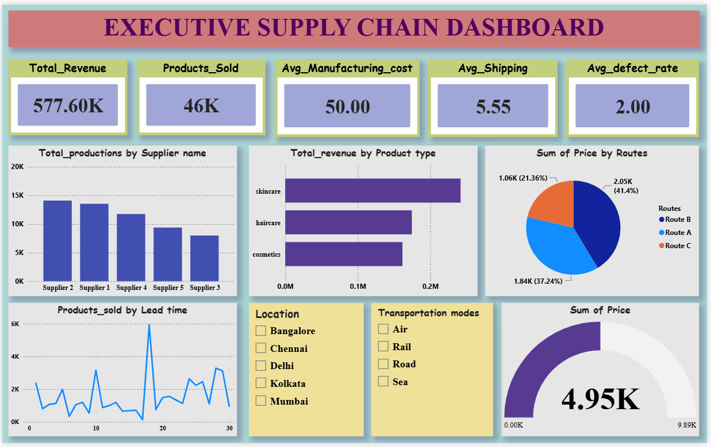

# 📦 Supply Chain Analysis

A comprehensive **Supply Chain Analysis** project that leverages **Business Intelligence** and **Data Visualization** techniques to analyze supply chain operations. This project provides valuable insights into sales performance, inventory management, manufacturing, supplier performance, and logistics to support data-driven business decisions.

---

## 📖 Project Overview

The primary objective of this project is to analyze supply chain data and identify trends that improve operational efficiency, reduce costs, and enhance overall business performance.

The analysis focuses on:

- 📈 Sales Performance
- 💰 Profitability Analysis
- 📦 Inventory Management
- 🚚 Logistics & Transportation
- 🏭 Manufacturing Performance
- 🤝 Supplier Performance
- 🌍 Regional Sales Performance
- 📊 Executive Business Overview

The repository contains an analytical report, presentation slides, and dashboard screenshots that summarize the findings and recommendations.

---

## 🎯 Objectives

- Analyze key supply chain performance metrics.
- Monitor inventory levels and stock movement.
- Evaluate supplier performance and reliability.
- Analyze manufacturing efficiency.
- Measure logistics and transportation performance.
- Identify sales trends across different regions.
- Develop interactive dashboards for business insights.
- Support data-driven decision making.

---

## 📂 Repository Structure

```text
Supply-Chain-Analysis/
│
├── Analysis Report for Supply Chain Analysis Project.pdf
├── Executive_supplychain_dashboard.png
├── Inventory_Analysis_Dashboard.png
├── Logistics and transportation dashboard.png
├── Manufacturing_Analysis dashboard.png
├── Supplier_performance Dashboard.png
├── Supply Chain Performance Analysis.pptx
└── README.md
```

---

## 📊 Dashboards Included

### 📈 Executive Dashboard

Provides a high-level overview of business performance, including:

- Total Sales
- Total Revenue
- Total Profit
- Total Orders
- Regional Sales
- KPI Summary

---

### 📦 Inventory Analysis Dashboard

Focuses on inventory operations and stock management.

Key metrics include:

- Inventory Levels
- Inventory Turnover
- Product Demand
- Stock Availability
- Inventory Status

---

### 🚚 Logistics & Transportation Dashboard

Analyzes logistics performance using metrics such as:

- Shipping Performance
- Delivery Time
- Transportation Cost
- Shipment Status
- Logistics KPIs

---

### 🏭 Manufacturing Analysis Dashboard

Provides manufacturing insights including:

- Production Performance
- Manufacturing Cost
- Production Efficiency
- Capacity Utilization
- Manufacturing KPIs

---

### 🤝 Supplier Performance Dashboard

Evaluates supplier effectiveness using:

- Supplier Performance Score
- Delivery Performance
- Supplier Reliability
- Purchase Analysis
- Supplier Ranking

---

## 📑 Analysis Report

The report includes:

- Business Problem Statement
- Dataset Overview
- Data Cleaning
- Exploratory Data Analysis
- KPI Evaluation
- Dashboard Interpretation
- Key Insights
- Business Recommendations

---

## 📽 Presentation

The PowerPoint presentation summarizes:

- Project Overview
- Business Objectives
- Dataset Description
- Dashboard Walkthrough
- Key Findings
- Recommendations

---

## 📊 Key Performance Indicators (KPIs)

- Total Sales
- Total Revenue
- Total Profit
- Total Orders
- Inventory Turnover
- Average Delivery Time
- Shipping Cost
- Manufacturing Efficiency
- Supplier Performance Score
- Regional Sales

---

## 📌 Key Insights

- High-performing products generate a significant share of total revenue.
- Optimizing inventory levels helps reduce operational costs.
- Manufacturing efficiency directly impacts profitability.
- Delivery delays can negatively affect customer satisfaction.
- Supplier performance varies across different vendors.
- Regional sales analysis highlights the most profitable markets.
- Logistics optimization can reduce transportation costs.

---

## 🚀 Business Recommendations

- Improve inventory planning to minimize stock shortages.
- Optimize logistics routes to reduce delivery delays.
- Strengthen relationships with reliable suppliers.
- Improve manufacturing efficiency to reduce production costs.
- Focus marketing efforts on high-performing regions.
- Continuously monitor KPIs using interactive dashboards.

---

## 🛠 Tools & Technologies

- Microsoft Excel
- Power BI
- Microsoft PowerPoint
- Data Visualization
- Business Intelligence
- Supply Chain Analytics

---

## 📷 Dashboard Preview

### 📊 Executive Dashboard



---

### 📦 Inventory Analysis Dashboard


---

### 🚚 Logistics & Transportation Dashboard


---

### 🏭 Manufacturing Analysis Dashboard


---

### 🤝 Supplier Performance Dashboard


---

## 📚 Files Included

| File | Description |
|------|-------------|
| Analysis Report | Complete project documentation |
| PowerPoint Presentation | Project summary |
| Dashboard Screenshots | Visual representation of the analysis |
| README.md | Project documentation |

---

## 🎓 Learning Outcomes

This project demonstrates skills in:

- Supply Chain Analytics
- Business Intelligence
- Dashboard Development
- Data Visualization
- KPI Analysis
- Business Reporting
- Data-Driven Decision Making

---

## 🤝 Contributing

Contributions are welcome.

1. Fork the repository.

2. Create a feature branch.

```bash
git checkout -b feature-name
```

3. Commit your changes.

```bash
git commit -m "Add new feature"
```

4. Push the branch.

```bash
git push origin feature-name
```

5. Open a Pull Request.

---

## 📄 License

This project is intended for educational and portfolio purposes only.
